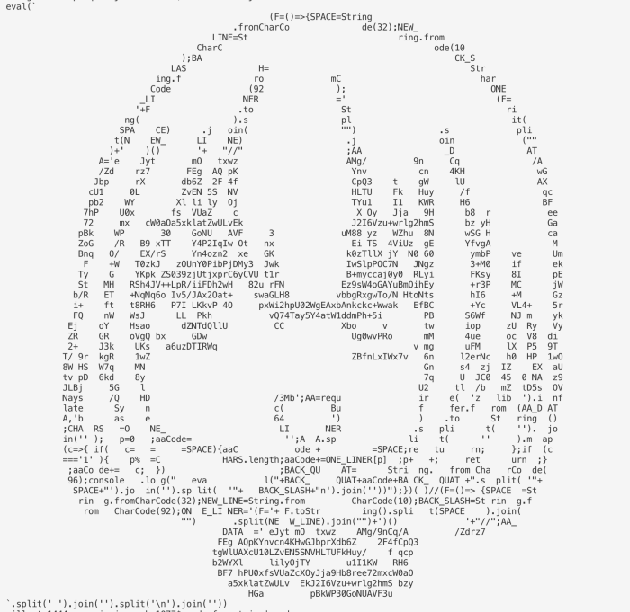

## JavaScriptで描くAA Quine
2019/11/06 Ginza.js

---

### 自己紹介

 - shopon (@sho_oishi)
 - 新卒ウェブエンジニア1年目
 - Electronがすき
 - 趣味でイラストを描く

---

### この発表のゴール
「Quine気になるかも」と思ってもらう

「Quine書けそうかも」と思ってもらう

---

### 今日話すこと
 - Quineとは
 - JavaScriptでQuineを書く方法
 - AA Quineの中身

---

### 今日話さないこと
 - 明日使える素晴らしいJavaScriptテクニック
 - Quineが何の役にたつか
 - 最適最良なQuineの書き方

---

## Quine?

---

### Quine #とは
 - 自分自身を出力するプログラム
 - 実行に応じて見た目を変化させるものもある
   - 例：山手Quine
     - 実行するたびに山手線の駅名を表示する
 - 書き方は様々
   - 今回のものが最適ではない

---

### JavaScriptでQuine
 - Q. 書けるの？
 - A. 書ける
```JavaScript
(f=()=>{console.log('(f='+f+')()');})()
```

---

### JavaScript版Quine
```JavaScript
(
    f = () => {
        console.log('(f=' + f + ')()')
    }
)()

//1行で書くとこう
(f=()=>{console.log('(f='+f+')()');})()
```

---

### AA Quine
> - 実行に応じて見た目を<br/>変化させるものある
 - Quineのコードでアスキーアートを表現する
 - 今回はこれがどんなものかを話します

---

## AA Quine

---

### 今回描いたQuine


[Gist](https://gist.github.com/shoponpon/7ec5cffedf2f35aff512085caf20f999)

---

### ベースとしたイラスト


描きました。

---

### AA Quineの構成
 - eval(`{アスキーアート}`);
   - AAはテンプレート文字列
 - テンプレートリテラルの中身を分解すると...
   - 配置情報
   - 整形処理
   - 出力
   - (コメント)
 - ルール
   - AAの文字数の中に上記の３つを収める
   - スペース、バッククォート、<br/>バックスラッシュを使わない

---

### AA Quineの描き方

---

## AA Quineを出力する<br/>プログラムを書く
メタプログラミング

---

```JavaScript
(F = () => {
    SPACE = String.fromCharCode(32);
    NEW_LINE = String.fromCharCode(10);
    BACK_SLASH = String.fromCharCode(92);
    ONE_LINER = '(F=' + F.toString().split(SPACE).join("").split(NEW_LINE).join("") + ')()' + "//";

    AA_DATA = '{zip圧縮&Base64エンコードされた0とスペースでできたAA文字列}';
    AA = require('zlib').inflateSync(Buffer.from(AA_DATA, 'base64')).toString();

    CHARS = ONE_LINER.split('').join('');
    p = 0;
    aaCode = '';
    AA.split('').map(c => {
        if (c === SPACE) {
            aaCode += SPACE;
            return;
        };
        if (c === '1') {
            p %= CHARS.length;
            aaCode += ONE_LINER[p];
            p++;
            return;
        };
        aaCode += c;
    });
    BACK_QUAT = String.fromCharCode(96);
    console.log("eval("+BACK_QUAT+aaCode+BACK_QUAT+".split('"+SPACE+"').join('').split('"+BACK_SLASH+"n').join(''))");
})()
```
 - これも、配置情報、整形処理、出力でできている

---

### 配置情報
```JavaScript
AA_DATA = '{zip圧縮&Base64エンコードされた0とスペースでできたAA文字列}';
AA = require('zlib').inflateSync(Buffer.from(AA_DATA, 'base64')).toString();
// zip圧縮&Base64エンコードされた0とスペースでできたAA文字列
// eJzVmFFywyAMRP99Cq7A/S/XcSEEgbRaIT5aTWbiOGifVrYJ4SnxqEo8WYFjQUYsqBqS5JVPZDntY2VfPSX9G5oqZOaRFbq6og8Rtwhr8yziPd4bBuWafhfDptqALKi9mpDKEeVsZSILH8LgrL4Mb0sHaj+aO9OO549d3q7LAI1qd28zKNJq25ocxerxRB17j2NyA8xsOSsKVZdEVcVZVtLB6f3UR7eUNJVgyUchEbS/6WzaIkUMUbyxsQt5jfuEWMlqVINETobpwZYJFtO8Sh7Imk/6/t3u7L10JKZxapJLxPa+7SsgWJhwBmpace9FgmCkQDINYabWKTiYaqUU4gaiYcXoWLSLsmZMDEbGnklDg/4KDN8kcRby9Rnj3Zg+lEZyDwGC8ajAjLIIVzmp+LnaLx2RlQhvav6HpNjS5DxmSmLtRSSNr5R/CNbysuzpO+j7YTrPbZ6tWtY/B70t77FynQBP2IFzmmJ2fLffhO3IQdqxZfV3uJEiFjs+YvEzsqw9lAOEWH0pCj3c3UlRBt89y4wNkqUDaStCe+QFm5tUfwAWyvQI
// 作り方
// const TEMP = `{スペースと1でできたAA文字列}`
//// 010101000001111111111111000000\n000000001111....
// const COMP_TEMP = require("zlib").deflateSync(TEMP).toString("base64")
```
 - コードをどんな形にするか、そのデータ
   - 今回はアスキーアート
 - データ量が多いのでzip圧縮&Base64エンコード
  - これができるだけ小さくなるほうがよい

---

### 2値化


お好きな画像編集ソフトで

---

### AA化
```
```

お好きなジェネレータで

---

### スペースと1だけでできたAA化
```
```

お好きなテキストエディタやコマンドで

---

### 整形処理
 - 配置情報を元にコードの形を作る処理
   - 1の場所のみコードを置いていく
 - 出力するコードの最後に`//`をつけて、<br/>２週目はコメントに
```JavaScript
ONE_LINER = '(F=' + 
  F.toString().split(SPACE).join("").split(NEW_LINE).join("") + 
  ')()' + "//";
p = 0;
aaCode = '';
AA.split('').map(c => {
    if (c === SPACE) {
        aaCode += SPACE;
        return;
    };
    if (c === '1') {
        p %= CHARS.length;
        aaCode += ONE_LINER[p];
        p++;
        return;
    };
    aaCode += c;
});
```

---

### 出力
 - 整形したものを出力する
 - Quineをプログラムコードとして実行できるようにするための必須処理を含む
```JavaScript
console.log(
  "eval(" + 
  BACK_QUAT + 
  aaCode + 
  BACK_QUAT + 
  ".split('"+SPACE+"').join('').split('"+BACK_SLASH+"n').join(''))"
);
```

---

### ルール
 - AAに収まる文字数
   - 収まらない時はAAを大きいサイズに
 - １行にまとめられるように書く
   - セミコロンあり
 - スペース、バッククォート、<br/>バックスラッシュを使わない
   - 文字コードで指定する
```JavaScript
SPACE = String.fromCharCode(32);
NEW_LINE = String.fromCharCode(10);
BACK_SLASH = String.fromCharCode(92);
```

---

### まとめ
 - Quineが書けた
 - 試行錯誤しながら書くのも楽しいです
   - `自分自身を出力する`を崩さないようにコードを足す

---

### おわり
ありがとうございました！

---

---

### おまけ

---

### ロジックを入れる例
```JavaScript
(f=(count)=>{
    count++;
    console.log('(f='+f+')('+count+')');
})(0)
```
 - 引数部分に出力される値が実行のたびに変わる
 - 実行回数に従い、引数の値が増える

---
